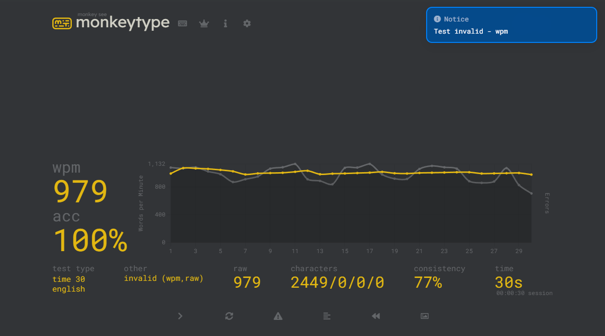

# Auto Monkey Type

Auto Monkey Type is a python program using Selenium to achieve an impossibly high WPM.



## Setup

1. Install Selenium.
```shell
pip install selenium
```
2. Install [Chrome Web Driver](https://googlechromelabs.github.io/chrome-for-testing/#stable) or the equivalent for your chosen browser, my implementation uses chrome, but Selenium supports: Google Chrome, Microsoft Edge, Mozilla Firefox, Apple Safari, and even Internet Explorer.
<br>
3. Put the Chrome Web Driver executable (or your browser specific driver) in the project directory.

4. (OPTIONAL) The lines:
``` python
    # selenium setup
    service = Service(executable_path="chromedriver.exe")
    driver = webdriver.Chrome(service=service)
```
need to be modified if you are using a different browser than chrome.

## Usage

In your terminal run:
```shell
python automt.py --wpm some_integer
```

#### WPM Accuracy

The ```wpm``` argument is a target WPM and loses precision as the ```wpm``` argument increases. This is because the process for grabbing the text from monkeytype.com is slow, and represents a larger percentage of the overall runtime as ```wpm``` increases. 

```wpm``` $\lt 200$ are usually $\pm 10$ from the intended WPM. Actual WPM will very greatly for WPM $\gt 200$. Machine performance is also a factor.

## License

This program is free software: you can redistribute it and/or modify it under the terms of the GNU General Public License as published by the Free Software Foundation, either version 3 of the License, or (at your option) any later version.

This program is distributed in the hope that it will be useful, but WITHOUT ANY WARRANTY; without even the implied warranty of MERCHANTABILITY or FITNESS FOR A PARTICULAR PURPOSE. See the GNU General Public License for more details.
